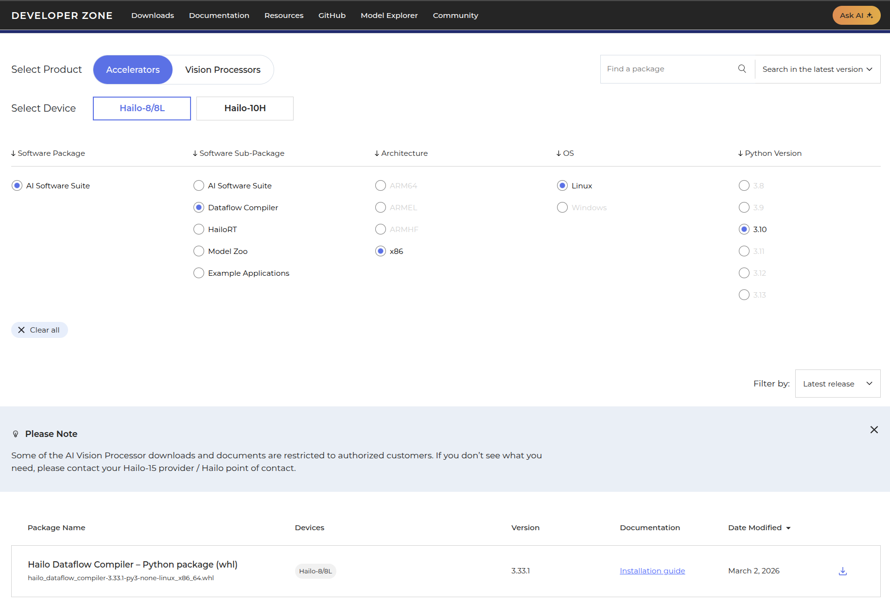

# Either use ubuntu 22.04LTS docker or WSL in windows

sudo apt update
sudo apt install python3-pip
sudo apt install python3.10-venv
sudo apt-get install python3.10-dev python3.10-distutils python3-tk libfuse2 graphviz libgraphviz-dev git wget unzip
sudo pip install pygraphviz
alias python=python3

# We create a new venv with python 3.10 version
python3 -m venv hailo_converter
source hailo_converter/bin/activate

# Download hailo DFC python wheel matching system version (x86) and python version (3.10)

# install wheel

pip install /path/to/hailo_dataflow_compiler-3.33.1-py3-none-linux_x86_64.whl

# verify installed packages

## check if cmd line works
hailo -h

## Check if pip packages installed correctly
pip freeze | grep hailo

# Download images and create calibration dataset
wget https://huggingface.co/datasets/LibreYOLO/coco-val2017/resolve/main/coco-val2017.zip
unzip coco-val2017

## Provide the location of images inside coco-val2017 folder and the python code will create a sample set of 1024 images by default as calibration datasets 
python prepare_dataset.py /path/to/coco-val2017/images/val2017/

# Create HEF file for LibreYOLOXs model

## Download ONNX file:

wget https://huggingface.co/fabricionarcizo/LibreYOLOXs/resolve/main/LibreYOLOXs.onnx

## Parse ONNX to HAR (Hailo Archive)

### We have Raspberry PI 5 w/ Hailo 8L AI Hat, so we use hailo8l as hardware architetcure

hailo parser onnx LibreYOLOXs.onnx \
    --hw-arch hailo8l \
    --har-path LibreYOLOXs.har

## Optimize HAR

hailo optimize LibreYOLOXs.har \
    --hw-arch hailo8l \
    --calib-set-path libreyolox_calib.npy \
    --model-script libreyolox.alls \
    --output-har-path LibreYOLOXs_quantized.har

## Now Compile HAR model and get HEF file

hailo compiler LibreYOLOXs_quantized.har \
    --hw-arch hailo8 \
    --output-har-path LibreYOLOXs_compiled.har

### Above line will generate hef file as well if not, use following command after above command

hailo har extract LibreYOLOXs_compiled.har

# 